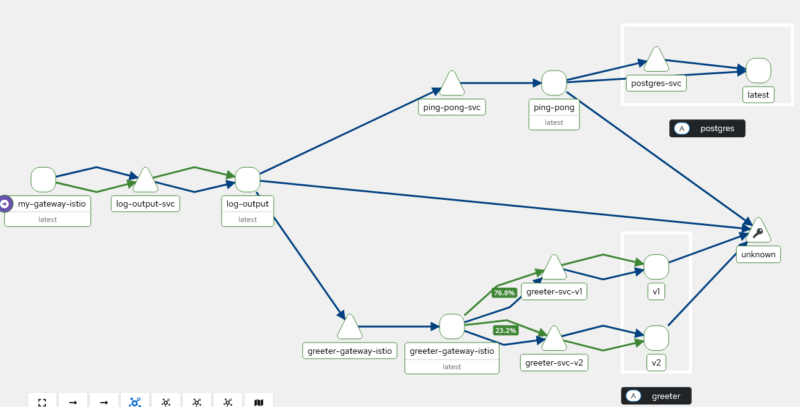

# Log output and ping pong exercises

```.github/workflows/ci-exercises.yaml``` updates the configs to use the latest images automatically after commit.

## Deploying

### Create a cluster without traefik
```sh
k3d cluster create --api-port 6550 -p '9080:80@loadbalancer' -p '9443:443@loadbalancer' --agents 2 --k3s-arg '--disable=traefik@server:*'
```

### Install istio to k3d
```sh
# Add repo if not done before
helm repo add istio https://istio-release.storage.googleapis.com/charts
helm repo update

kubectl get crd gateways.gateway.networking.k8s.io &> /dev/null || \
kubectl apply -f https://github.com/kubernetes-sigs/gateway-api/releases/download/v1.3.0/standard-install.yaml

istioctl install --set profile=ambient --skip-confirmation --set values.global.platform=k3d
```

Add argo rollouts:
```sh
kubectl create namespace argo-rollouts
kubectl apply -n argo-rollouts -f https://github.com/argoproj/argo-rollouts/releases/latest/download/install.yaml
```

Add prometheus:
```sh
# Adding these repos might not be necessary if it has been done before
helm repo add prometheus-community https://prometheus-community.github.io/helm-charts
helm repo add stable https://charts.helm.sh/stable
helm repo update

kubectl create namespace prometheus
helm install kube-prometheus prometheus-community/kube-prometheus-stack --namespace prometheus
```

Deploy:
```sh
## Option 1
kubectl create namespace argocd
kubectl apply -n argocd -f https://raw.githubusercontent.com/argoproj/argo-cd/stable/manifests/install.yaml
kubectl patch svc argocd-server -n argocd -p '{"spec": {"type": "LoadBalancer"}}'

# Get ip and password
kubectl get svc -n argocd
kubectl -n argocd get secret argocd-initial-admin-secret -o jsonpath="{.data.password}" | base64 -d


# Option 2
kubectl apply -k .
```

Access the app with: ```kubectl port-forward svc/my-gateway-istio 80```

Check the kiali visualization: ```istioctl dashboard kiali```


